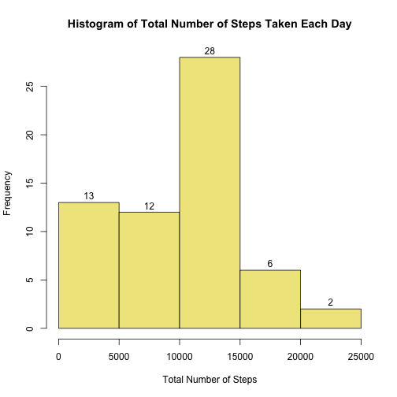
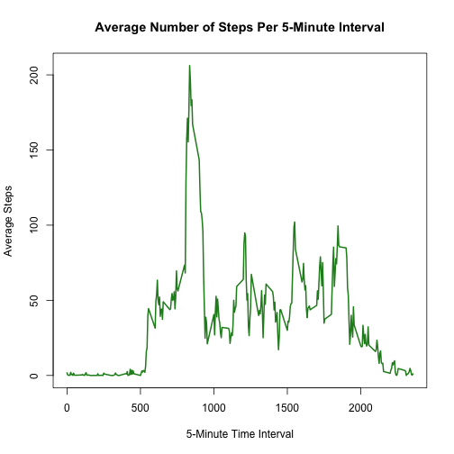
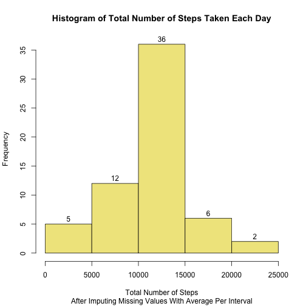
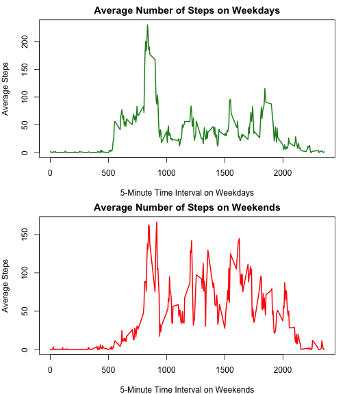

   
    
## Loading and preprocessing the data

```r
act=read.csv(file="activity.csv")
df=data.frame(steps=tapply(act$steps, act$date, FUN=sum, na.rm=TRUE) )
```
  
## What is mean total number of steps taken per day?

```r
meansteps=mean(df$steps)
mediansteps=median(df$steps)
hist(df$steps , col="khaki" , main="Histogram of Total Number of Steps Taken Each Day", xlab="Total Number of Steps" , labels=TRUE )
```

 
  
>The **mean** total number of steps taken per day is **9354.2295** and the **median** is **10395**. 
 
  
  
## What is the average daily activity pattern?  


```r
adap= data.frame( steps=tapply(act$steps, act$interval, FUN=mean, na.rm=TRUE))
adap$interval = as.integer(rownames(adap))
maxavestep=adap[adap$steps==max(adap$steps), "steps"]
maxaveinterv=adap[adap$steps==max(adap$steps), "interval"]
plot( adap$interval, adap$steps, type="l" , col="forestgreen" , main="Average Number of Steps Per 5-Minute Interval" ,lwd=2,  xlab="5-Minute Time Interval" , ylab="Average Steps")
```

 
  
>The interval with the **highest average** is at interval **835** with an average steps of **206.1698**. 

  
## Imputing missing values  


```r
NAcount=sum(is.na(act$steps))
NApercent=mean(is.na(act$steps))*100.0
actCount=length(act$steps)
```

>There are 2304 or (13.1148%) missing values out of 17568 rows.  


```r
# impute missing values with average of 5-minute interval
# by creating new dataset "act2" from "act" dataset
ds1=act[is.na(act$steps),] # all missing values
ds1$seq=as.integer(row.names(ds1)) # save the original sequence of ds1
ds2=act[!is.na(act$steps),] # all with values
ds2$seq=as.integer(row.names(ds2)) # save the original sequence of ds2
mrg=merge(ds1,adap, by=c("interval")) # merge ds1 with interval average

# ds3 is a recreated ds1 with steps substituted with average
ds3=data.frame( steps=mrg$steps.y, date=mrg$date
                , interval=mrg$interval, seq=mrg$seq)

ods2=order(ds2$seq)
ods3=order(ds3$seq)
act2=data.frame(rbind(ds3[ods3,],ds2[ods2,]), row.names=4)

df2=data.frame(steps=tapply(act2$steps, act2$date, FUN=sum, na.rm=TRUE) )
meansteps2=as.numeric(mean(df2$steps))
mediansteps2=median(df2$steps)
```

> After imputing the missing values with the average of the corresponding Time Interval, the frequency in the mean range of distribution (10-15K range)  had increased while the minimum range (0-5K) had decreased.  The mean of the total number of steps taken per day compared to previous is also changed to **10766** (was 9354) as well as the **median** to **10766** (was 10395).  


```r
hist(df2$steps , col="khaki" , main="Histogram of Total Number of Steps Taken Each Day"
     , xlab="Total Number of Steps" , labels=TRUE, sub="After Imputing Missing Values With Average Per Interval")
```

 


## Are there differences in activity patterns between weekdays and weekends?  


```r
act2$day=weekdays(as.Date(act2$date), abbreviate=TRUE)

wkends=act2[ act2$day=="Sat" | act2$day=="Sun",]
avwkend=data.frame( steps=tapply(wkends$steps, wkends$interval, FUN=mean, na.rm=TRUE))
avwkend$interval=rownames(avwkend)

wkdays=act2[ !(act2$day=="Sat" | act2$day=="Sun"),]
avwkday=data.frame( steps=tapply(wkdays$steps, wkdays$interval, FUN=mean, na.rm=TRUE))
avwkday$interval=rownames(avwkday)

par(mfrow=c(2,1), mar=c(4,4,2,1))

plot(avwkday$interval, avwkday$steps, type="l" , col="forestgreen" , main="Average Number of Steps on Weekdays" ,lwd=2,  xlab="5-Minute Time Interval on Weekdays" , ylab="Average Steps")

 plot(avwkend$interval, avwkend$steps, type="l" , col="red" , main="Average Number of Steps on Weekends" ,lwd=2,  xlab="5-Minute Time Interval on Weekends" , ylab="Average Steps")
```

 

> Comparing the average number of steps between the Weekday and Weekend days, it appears that during the weekends, the average steps during mid-morning up to early evening are high compared to the same time intervals during the weekdays. 


